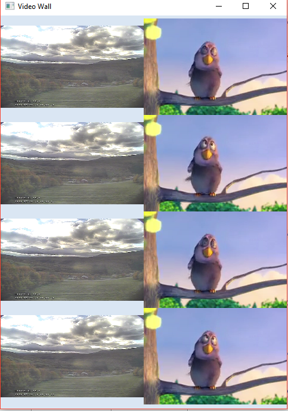
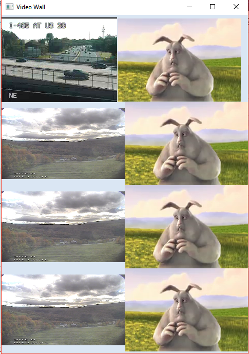

# videoWall
videoWall with videoLAN (VLAN) and vlcj

# Configuration
This is developed to make a grid with 4 rows and 2 columns. Video will appear in each cell of the grid.

```
videowall.height=660
videowall.width=480
videowall.rows=4
videwall.columns=2
server.port=1971
```
 

# How to run
* mvnw.cmd spring-boot:run (Windows OS)
* ./mvnw spring-boot:run (Linux)

# Initial Screen


# How to change video

```
curl -X POST -H 'Content-Type: application/json' -i http://localhost:1971/api/v1/video/set --data '{ "url":"rtsp://170.93.143.139/rtplive/470011e600ef003a004ee33696235daa",
"videoIndex":0}'
```

# Screen after updating first video


## Publicly available RTSP URL for testing
*
*
* 
# Motivation
[Sprint tips for JavaFX and spring boot](https://spring.io/blog/2019/01/16/spring-tips-javafx)